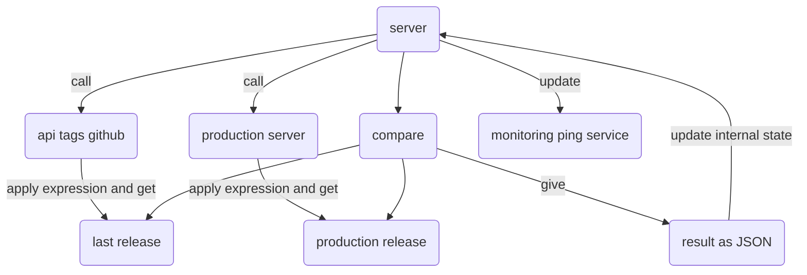

# UTDON (UpToDateOrNot??) - [Translated by deepl.com]

Are your FOSS (Free and open-source software) applications in production up to date?

## Introducing

UTDON was born from a shell that compares :

- the version of an application currently running (production)
- the latest version available (GITHUB repository).

As UTDON only works with applications whose source repository is located on "GitHub", it currently only works with GitHub.

## UTDON Versioning

UDON follows the "semver" protocol (<https://semver.org/>), accessible via the "/api/v1/version" entrypoint, which returns a value in JSON format: {"version":"[\d+]\.[\d+]\.[\d+]} (3 groups of numbers separated by a dot).

GitHub "tags" and container "tags" will remain similar to this response.

Release Candidates will be defined as follows: "[\d+]\.[\d+]\.[\d+]-rc-[\d+]".

## How does it work?

- [Install the service & start it up](./doc/en/INSTALL.md)
- Use your web browser to connect to the service:
  - http://[IP address]:[port]/
  - default login/password: admin/admin
- Change the password.
- [Create the first "control" (which may be your new UTDON service... to check that everything is working)](./doc/en/CONTROL.md)
- You run the comparison.
- Each control indicates its last "comparison" status.
- To automate the process, create a cron job with "curl" that calls the entrypoint of your choice:
  - comparison only: the state is updated at application level
  - comparison with the monitoring service update, and you'll be notified of any discrepancies.

## Flow

## Stack

- Nodejs
- React/Redux
- JSON databases: located in RAM, replacing files during execution has no effect. Database contents are saved after each modification and when the service receives the SGINT | SIGTERM | SIGUSR2 signal.
- RegExp and Jmespath filters for Json.

## Security

Never expose UTDON directly to the Internet (use a VPN if necessary). UTDON is an internal, self-hosted tool that performs actions on your private resources (Monitoring/CI-CD).

**Refuse all SAAS hosting**: This product has not been designed to be multi-tenant, and is not protected by an E2E solution. Authentication data is encrypted using a string that would be supplied by the potential host and therefore decipherable by it. Understand that UTDON "controls" contain the url of the service to be monitored, and potentially access to your CI/CD chain and/or monitoring service.

### Encryption

The contents of both databases are partially encrypted:

- user.json: Administrator password (non-reversible) and authentication token (reversible)
- database.json: Authentication strings for monitoring urls and CI/CD chain (reversible).

### If you've lost the admin password

Stop the service, delete the "user.json" file, then restart. Then log in with the default account/password: admin/admin, then change it immediately.

### Session

Sessions are managed in RAM, so a simple service restart resets all sessions.

## Roadmap

- Github authentication to remove rate-limit barrier.
- Duplicate a control.
- Display filters.
- Controls sorted into groups.
- Multiple "Auth Bearer" per control to avoid providing admin authentication token.
- S3 storage.
- Entrypoint API metrics.
- LDAP authentication.

## Credits

- login page image: generated by AI <https://www.artguru.ai/fr/>

- Radioactive button: <https://zurb.com/playground/radioactive-buttons>

- Logo: <https://www.instagram.com/henry_redbeard_overland/>

## If you like this application

Give it a star...
