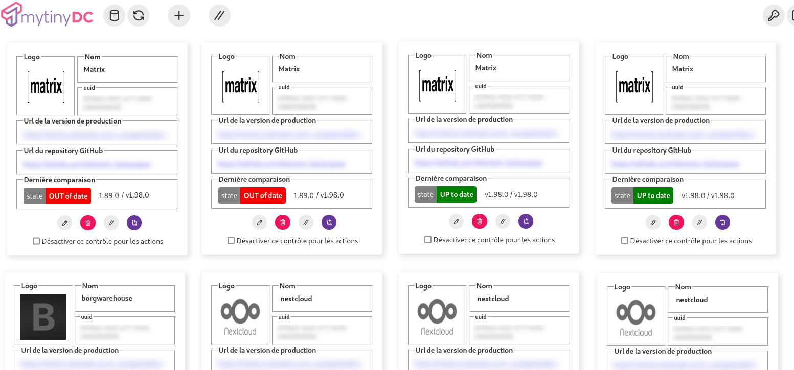
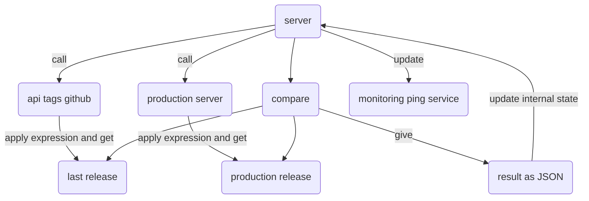

[English documentation](./README-en.md)

# UTDON (UpToDateOrNot??)

Vos applications FOSS (Free and open-source software) en production, sont-elles à jour ?

## Présentation

UTDON est né d'un shell qui compare :

- la version d'une application en cours d'exécution (production)
- à la dernière version disponible (dépôt GITHUB).

N'ayant que des applications dont le dépôt des sources est situé sur "GitHub", UTDON ne fonctionne pour l'instant qu'avec GitHub.

## Cas d'utilisation

- Surveillance par UI.
- Surveillance par appel API.
- Surveillance par appel API et mise à jour d'un service de monitoring (type ping).
- Appel API pour déclencher la mise à jour par une action sur la chaine CI/CD.

## Versioning UTDON

UDON suit le protocole "semver" (<https://semver.org/>), accessible par l'entrypoint "/api/v1/version" qui renvoit une valeur au format JSON : {"version":"[\d+]\.[\d+]\.[\d+]} (3 groupes de nombres séparés par un point).

Les "tags" GitHub, ainsi que les "tags" des containers resteront similaires à cette réponse.

Les versions "Release Candidats" seront définies comme suit : "[\d+]\.[\d+]\.[\d+]-rc-[\d+]".

## Comment çà marche ?

- [Installer le service & le démarrer](./doc/INSTALL.md)
- Utilisez votre navigateur web pour vous connecter au service :
  - http://[Addresse IP]:[port]/
  - login/mot de passe par défaut: admin/admin
- Vous changez le mot de passe.
- [Création du premier "contrôle" (qui peut être votre nouveau service UTDON... pour vérifier que tout fonctionne)](./doc/CONTROL.md)
- Vous exécuter la comparaison.
- Chaque contrôle indique son dernier état de "comparaison".
- Pour automatiser l'ensemble, créez une tâche d'ordonnancement (cron) avec "curl" qui appelle l'entrypoint de votre choix :
  - uniquement la comparaison, l'état est mis à jour au niveau de l'application
  - la comparaison avec la mise à jour du service monitoring et vous serez averti des écarts constatés.

## Flux

## Stack

- Nodejs
- React/Redux
- Base de données JSON : Situées en RAM, si vous remplacer les fichiers en cours d'exécution, ceci n'aura aucun effet. Le contenu des bases est enregistré après chaque modification et lorsque le service reçoit le signal SGINT | SIGTERM | SIGUSR2.
- Filtres RegExp et Jmespath pour Json.
- Swagger.

## Securité

Ne jamais exposer UTDON directement sur internet (utilisez un VPN si nécessaire). UTDON est un outil interne, auto-hébergé, qui exécute des actions sur vos ressources privées (Monitoring/CI-CD).

**Refuser tout hébergement SAAS**: Ce produit n'a pas été dessiné pour être "multi-tenant" et n'est pas protégé par une solution "E2E". Les données d'authentification sont chiffrées au moyen d'une chaîne qui serait fournie pas le potentiel hébergeur et donc déchifrable par lui. Comprenez que les "contrôles" UTDON contiennent l'url du service à surveiller, et potentiellement les accès à votre chaîne CI/CD et/ou service de monitoring.

### Chiffrement

Le contenu des deux bases de données est chiffré partiellement :

- user.json: Le mot de passe de l'administrateur (non réversible) et le jeton d'authentification (réversible)
- database.json: Les chaînes d'authentification pour les "urls" de monitoring et de la chaine CI/CD (réversibles).

### Si vous avez perdu le mot de passe admin

Arréter le service, supprimer le fichier "user.json", puis redémarrer. Connectez-vous ensuite avec le compte/mot de passe par défaut : admin/admin, puis changer le immédiatement.

### Session

Les sessions sont gérées en RAM, un simple redémarrage du service réinitialise l'intégralité des sessions.

## Roadmap

- Authentification Github pour supprimer la barrière "rate-limit".
- Dupliquer un contrôle.
- Filtres pour l'affichage.
- Classement des contrôles par groupes.
- Plusieurs "Auth Token" par contrôle pour éviter de fournir le jeton d'authentification de l'admin.
- Stockage S3.
- Entrypoint API metrics.
- Authentification LDAP.

## Crédits

- image de la page de connexion: générée par l'AI <https://www.artguru.ai/fr/>

- Radioactive button : <https://zurb.com/playground/radioactive-buttons>

- Logo: <https://www.instagram.com/henry_redbeard_overland/>

## Si vous appréciez cette application

Donnez lui une étoile...
