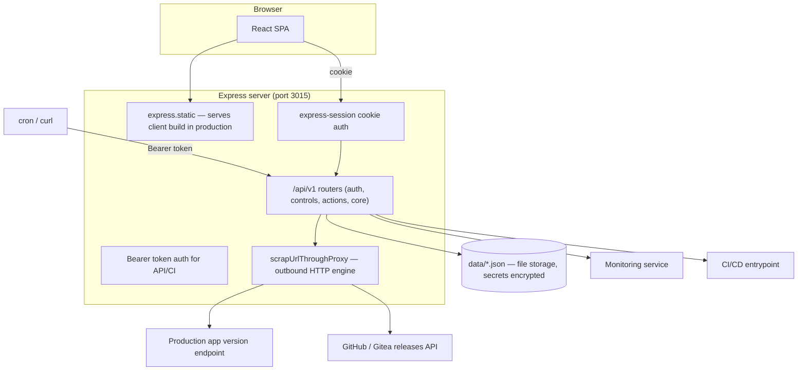
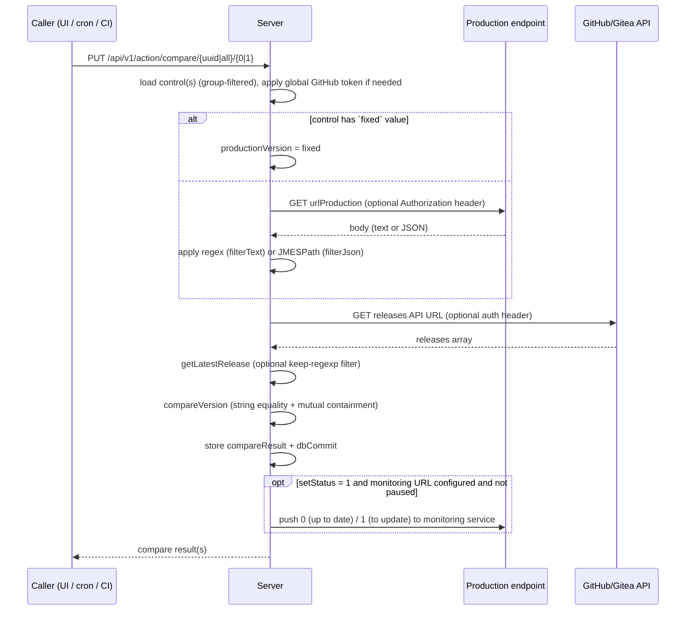

# 01 — Overview

## What UTDON is

UTDON (**Up**To**Date**Or**Not**?) answers one question: *are the FOSS applications you
run in production up to date?*

A **Control** is the central object. It pairs:

1. a way to read the **version currently running in production** — either an HTTP
   endpoint (scraped with a regex or a JMESPath expression) or a fixed/pinned value, and
2. the **latest release** of the project's source repository (GitHub or any
   Gitea-compatible forge such as Codeberg).

The server scrapes both sides, compares them, stores the result, and can then:

- display it in the web dashboard (per-control badge: up to date / to update / warning),
- push `0`/`1` to an external monitoring service (Healthchecks-style ping),
- expose the latest release tag for a CI/CD chain,
- optionally trigger a CI/CD entrypoint on demand.

Typical automation is a cron job calling the compare endpoint with `curl` (the UI can
generate ready-to-copy curl commands using the user's API token).

## Repository layout

```
utdon/                          # monorepo: server at root, client in client/
├── src/                        # SERVER (Express 5 + TypeScript, ESM)
│   ├── main.ts                 # entry point — boot, middleware, routers
│   ├── Constants.ts            # production constants (version, timeouts, entrypoints…)
│   ├── Constants-dev.ts        # Storybook fixtures only (not used by server)
│   ├── Global.types.ts         # shared domain types (used by server AND client)
│   ├── ServerTypes.ts          # express-session type extension
│   ├── routes/                 # routerAuth, routerControls, routerActions, routerCore
│   └── lib/                    # Authentification, Database, scraping, comparison…
├── client/                     # CLIENT (React 18 + Vite 4 SPA)
│   ├── src/api/                # RTK Query API layer
│   ├── src/app/                # store, slices, router
│   ├── src/components/         # reusable UI kit + control-editing components
│   ├── src/features/           # pages (home, login, control wizard, user manager…)
│   └── src/helpers/            # misc client helpers
├── data/                       # RUNTIME STORAGE (JSON databases; git-ignored)
├── cacerts/                    # optional proxy CA certificates
├── test/                       # Jest test suite (server) + fixtures in test/samples
├── doc/                        # user documentation (EN/FR): INSTALL, GROUPS, CONTROL
├── locales/fr.json             # French UI translations (keys are English sentences)
├── openapi.yaml                # Swagger spec (partial — see 03-api-reference.md)
├── Dockerfile / Dockerfile-dev # production / dev images
├── build-prod.sh / build-dev.sh
├── updateVersion.sh            # semver bump across packages
└── checkHardCoded.sh           # pre-commit secret-scanning guard
```

## Tech stack

| Layer | Technology | Version (analyzed) |
|---|---|---|
| Server runtime | Node.js (Docker base image) | 22.22.3-alpine |
| Server framework | Express | 5.2 |
| Session | express-session (MemoryStore) | 1.19 |
| Security headers | helmet | 8.2 |
| Logging | winston (JSON, console) | 3.19 |
| API docs | swagger-ui-express + yaml | 5.0 |
| Scraping/extraction | `@metrichor/jmespath`, raw `http`/`https` + proxy agents | — |
| Client framework | React + ReactDOM | 18.3 |
| Client build | Vite (`@vitejs/plugin-react`) | 4.5 |
| State | Redux Toolkit 1.9 + RTK Query, react-redux 8.1 | — |
| Routing | react-router-dom 6 (`createBrowserRouter`) | 6.30 |
| i18n | react-intl (en = source keys, fr = `locales/fr.json`) | 6.8 |
| Styling | Sass (hand-rolled component kit, no UI framework) | 1.100 |
| Testing | Jest 30 + ts-jest (server only; no client tests) | — |

## Runtime topology



- **Development**: the Express server runs via nodemon/tsx on port **3015** and serves
  the client's *build output* from `client/dist/`; the Vite dev server runs separately
  on port **7852** and proxies `/api` to `http://0.0.0.0:3015`
  ([client/vite.config.ts](../client/vite.config.ts)).
- **Production (Docker)**: the client build is copied into the image at `/app/public`
  and served by the same Express process on the four SPA routes (`/`, `/login`,
  `/ui/addcontrol`, `/ui/editcontrol/*`). One container, one port (3015).

### Important cross-boundary detail

The client imports shared code **directly from the server tree**
(`../../src/Global.types`, `../../src/Constants`, `src/lib/helperProdVersionReader.ts`,
`src/lib/helperGitRepository.ts`, `locales/fr.json`). This guarantees that version
extraction (regex / JMESPath) behaves identically in the browser wizard and on the
server at compare time, and that types never drift. It also means the client build
requires the full repository checkout — `client/` is not standalone.

## Core concepts

| Concept | Description |
|---|---|
| **Control** (`UptodateForm`) | One monitored application: production URL + extraction expression, git repo URL + tag filter, optional monitoring/CI-CD hooks, groups, logo, compare result. |
| **Compare** (`getUpToDateOrNotState`) | Scrapes production version (or uses the fixed value), fetches latest git release, runs `compareVersion`, stores `compareResult`. Triggered per control or for `all`. |
| **User** | Login + PBKDF2-hashed password + encrypted Bearer token. Created/managed by admins. |
| **Group** | Named set of user UUIDs. The `admin` group is the built-in role. Controls are visible/editable by members of any group they reference. |
| **Global GitHub token** | Optional admin-managed PAT applied server-side to GitHub API calls for controls that have no per-control auth header (avoids rate limiting). |
| **Actions** | Push state to a monitoring service (`/action/setstatus`, or automatically after compare with `setStatus=1`); trigger a CI/CD entrypoint (`/action/cicd`). |

## Comparison flow (the heart of the app)



See [05-server-libraries.md](./05-server-libraries.md) for the exact semantics of each
step (notably: `compareVersion` is string-containment based, **not** semver-aware).
