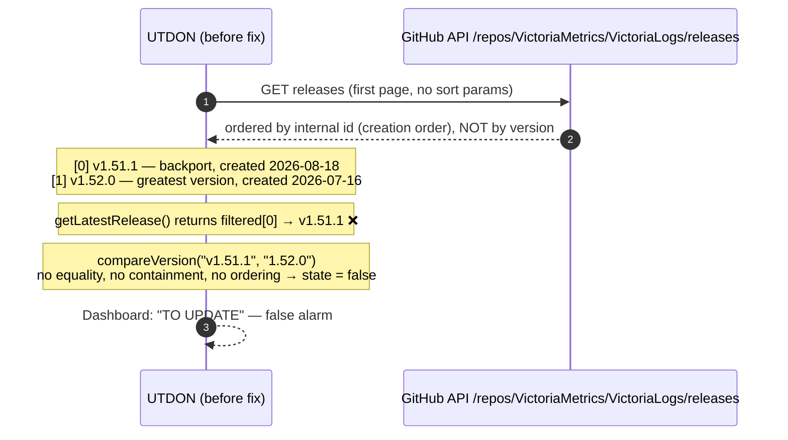
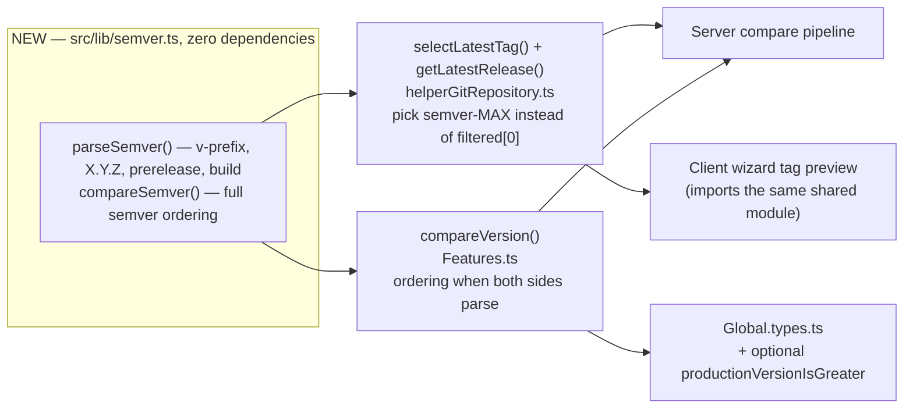
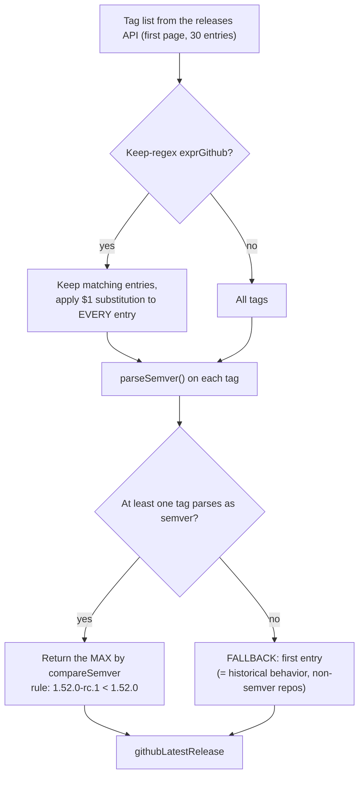
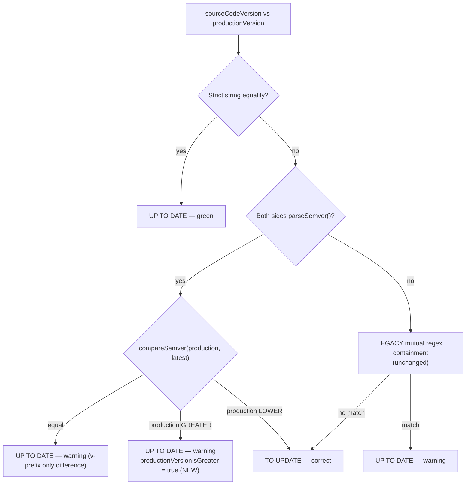

# 11 — Issue #26: Version Ordering — Design & Fix

Fix for [github.com/dhenry123/utdon/issues/26](https://github.com/dhenry123/utdon/issues/26)
("Versions ordering issues?", reported by skid9000), implemented test-first on branch
`fix/issue-26-version-ordering`.

## Problem

Two reported defects, both confirmed:

1. **Wrong "latest" release.** `getLatestRelease` returned the **first** entry of the
   releases array, assuming the forge lists the newest version first. GitHub/Gitea
   order releases by **internal id (creation order)**. Any repo that publishes a
   release for an older branch *after* a newer one (backports, security patches)
   breaks the assumption — e.g. VictoriaLogs: the `v1.51.1` backport (created
   2026-08-18) is listed **before** `v1.52.0` (created 2026-07-16). Not an isolated
   case: it affects every repo with out-of-order publishing.
2. **No ordering in the comparison.** `compareVersion` used string equality plus
   mutual regex containment only. A production version **newer** than the detected
   release was flagged "TO UPDATE" (false alarm).



## Solution



### `selectLatestTag(tags, filtersName?)` — new shared export



`getLatestRelease` now extracts tag names and delegates to `selectLatestTag`.
`filterAndReplace` is kept for compatibility but no longer used for selection.
The client wizard (`ScrapGitHubReleaseTags.tsx`) calls `selectLatestTag` too, so the
"latest available version detected" preview matches the server exactly.

### `compareVersion` — semver first, legacy fallback



- The containment flags keep their original meaning (string relationships) and are
  still computed, so existing UI displays are unchanged.
- `productionVersionIsGreater` (optional field on `UptoDateOrNotState`) marks the
  "running ahead of the latest release" case. Per the reporter's suggestion in the
  issue thread, the UI renders it as a **gray "Unknown" badge** (`Badge isUnknown`,
  `Control.tsx`, `ResultCompare.tsx`) with a dedicated message in the compare dialog —
  deliberately not "UP to date", since the state is undeterminable (the matching
  release may simply not be published yet).
- Old persisted `compareResult`s stay valid: the new field is optional.
- Pure semver choice, documented: `1.53.0-rc.1` **beats** `1.52.0` (use the keep-regex
  to exclude prereleases when undesired).

## Validation

- Test-first: 35 new tests (`test/semver.test.ts` 16, `Features.test.ts` +7,
  `helperGitRepository.test.ts` +12, including offline fixture
  `test/samples/releases-out-of-order.json` modeled on the VictoriaLogs response).
- Live end-to-end through the real VictoriaLogs API:
  - production `1.52.0` → latest correctly `v1.52.0` → **up to date** (was: false alarm);
  - production `1.53.0` → **up to date, warning, `productionVersionIsGreater: true`**.
- Behavioral change to note in the changelog: for repos maintaining two version
  streams without a keep-regex, the greatest (e.g. 2.x) now wins.

## Test-environment note: local proxy

The Jest suite hits live endpoints, some through the corporate proxy configured in
`.envTest` (`HTTP_PROXY`/`HTTPS_PROXY`). When no proxy is available, this repository
now ships a minimal dependency-free proxy:

```bash
npm run startLocalProxy   # listens on http://127.0.0.1:3128
```

Then point `.envTest` at it (`HTTP_PROXY`/`HTTPS_PROXY` =
`http://127.0.0.1:3128`, `PROXYCA_CERT=""` — HTTPS is tunneled with CONNECT, TLS
stays end-to-end, no CA needed). See `.envTest-sample`.

Known unrelated failure: `getUpToDateOrNotState - GitHub header autorization` requires
a **valid** `GITHUBTOKEN` in `.envTest`; an expired token yields GitHub 401
"Bad credentials".
