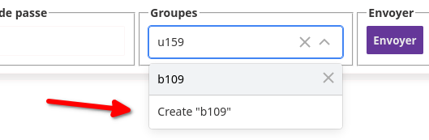
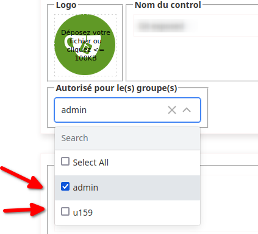

# Gestion des utilisateurs/groupes

Introduit dans la version 1.4, les utilisateurs peuvent être gérés par groupes, et chaque contrôles peut-être affecté **à un ou plusieurs groupes**.

## Création des groupes

Se connecter en administrateur, puis ouvrir le module de "gestion des utilisateurs".

Selectionner ou ajouter un utilisateur, dans la zone de recherche des "Groupes", taper le nom du nouveau groupe , le composant vous proposera de créer le groupe.

Envoyer les modifications, **le ou les groupes** sont créés.

## Affectation d'un contrôle aux groupes

**Pour réduire la compléxité**, la gestion "fine" des contrôles n'a pas été implémentée (read/write/execute).

Quand un contrôle est affecté à un groupe, chaque utilisateur du groupe devient "gestionnaire" de ce contrôle. Il peut par conséquent le modifier ou le supprimer.

## Affectation automatique des groupes

Lorsque qu'un **administrateur** crée un contrôle, **il doit affecter** un ou plusieurs groupes ayant autorité sur ce dernier.

Lorsque qu'un utilisateur **non administrateur** crée un contrôle, il est automatiquement affecté à tous ses groupes, libre à lui de réduire cette sélection.

**Un contrôle ne peut être enregistré que** s'il dispose d'au moins un groupe.
