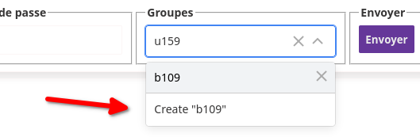
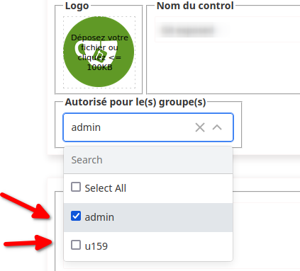

# User/group management

Introduced in version 1.4, users can be managed in groups, and each control can be assigned **to one or more groups**.

## Création des groupes

Log on as administrator, then open the "user management" module.

Select or add a user, in the "Groups" search box, type the name of the new group, the component will prompt you to create the group.

Send the changes, **the group or groups** are created.

## Assigning control to groups

**To reduce complexity**, fine-grained control management has not been implemented (read/write/execute).

When a control is assigned to a group, each user in the group becomes the "manager" of that control. They can therefore modify or delete it.

## Automatic group assignment

When an **administrator** creates a control, **he/she must assign** one or more groups with authority over it.

When a **non-administrator** user creates a control, it is automatically assigned to all its groups, but they are free to reduce this selection.

**A control can only be registered** if it has at least one group.
